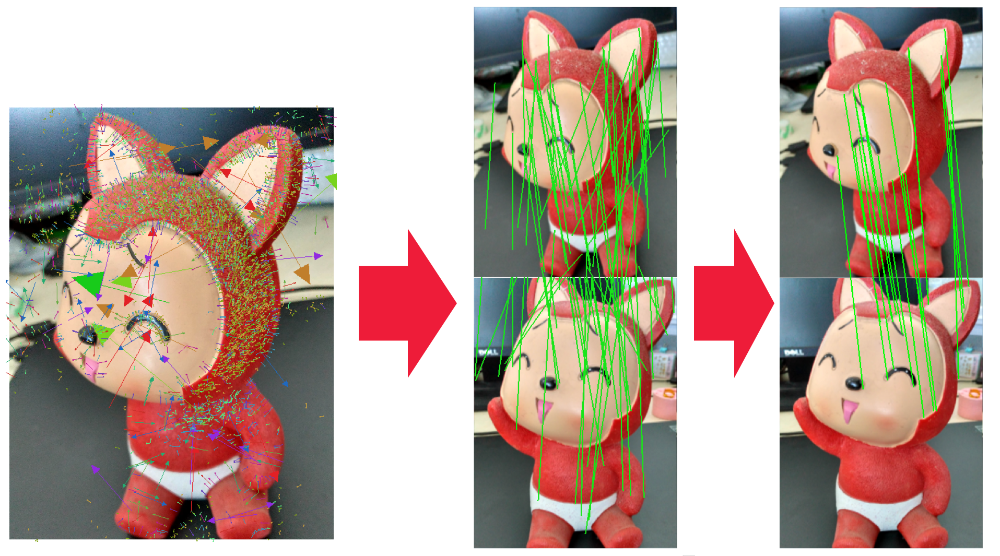
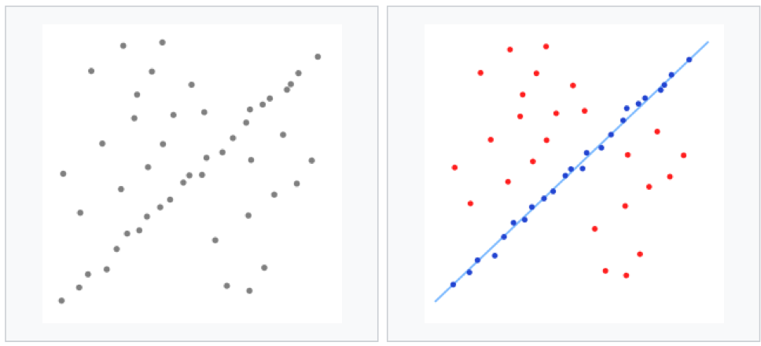
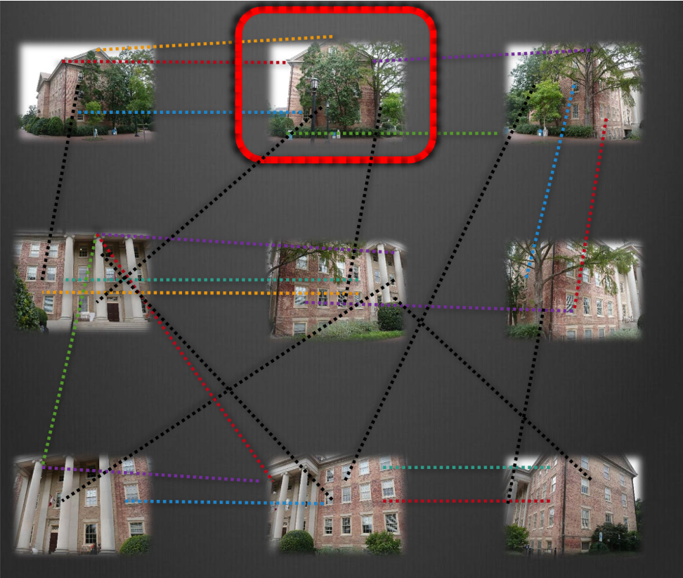
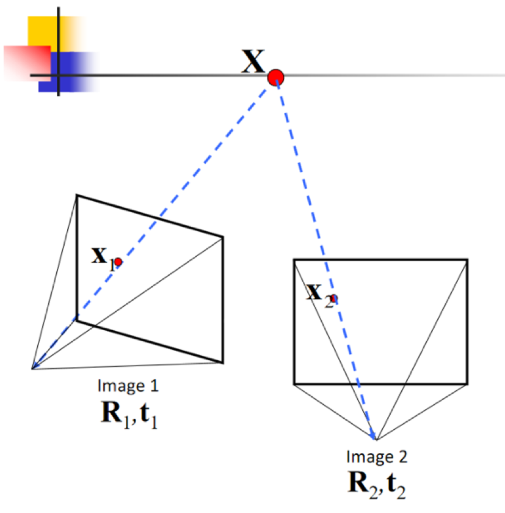
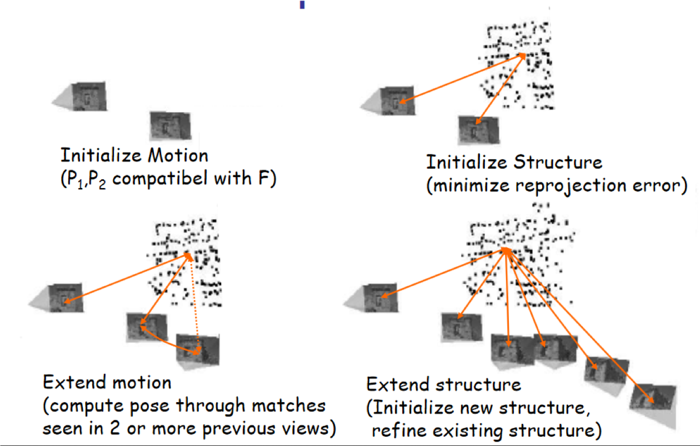
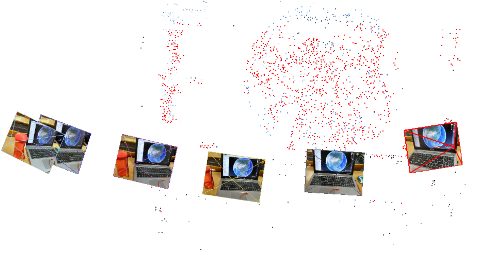
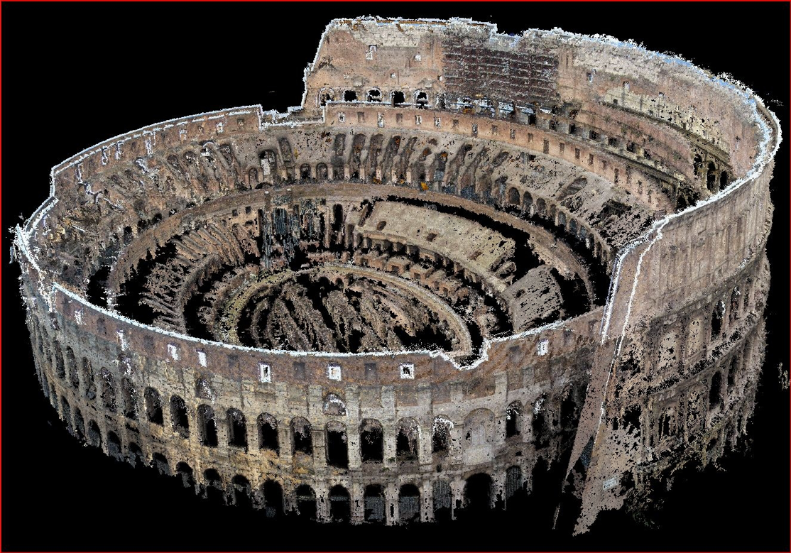
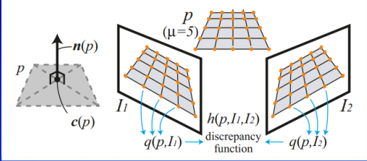
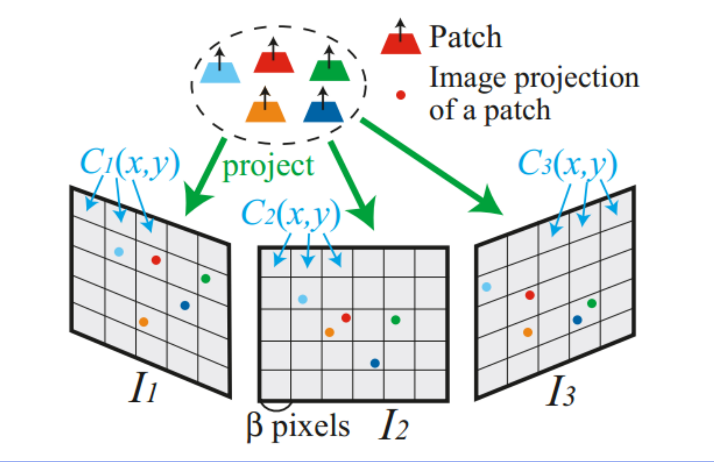

<!-- page_number: true -->
<!--$theme: gaia-->

　
# 遥感数字图像处理实验课
## - 图像特征提取与三维重建
  
崔家梁  
(cuijialiang@pku.edu.cn)  
2018年12月

---
# 本节课内容
- 特征提取
	- harris角点检测
	- SIFT角点检测与描述
- 三维重建
	- SFM
	- PMVS

---
# 图像匹配
- 寻找图像中的共同点.

---
# 图像中的特征

面特征 : A,B --- 容易重复  
边特征 : C,D --- 容易重复  
角特征 : E,F --- 不容易重复√

---
#### Harris 角点检测---邻域滑动窗口

---
# Harris 特征
在图像$I$中,记点$(x,y)$的亮度为$I(x,y)$.则其与附近某点$(x+u,y+v)$的亮度差可以用下式衡量:
$$\small \Delta^2I=[I(x+u,y+v)-I(x,y)]^2$$
在某片区域$D$中所有像素与与之相差向量$(u,v)$的对应点亮度之差的大小可以用下式衡量:
$$\small E(u,v)=\sum_{(x,y)\in D} w(x,y)[I(x+u,y+v)-I(x,y)]^2$$
其中$w(x,y)$是权重因子,通常取常数.

---
#### (接上)Harris 特征
将$\small I(x+u,y+v)$在$(x,y)$处泰勒展开,取一阶近似,有:  

$\small\Delta^2I=[I(x+u,y+v)-I(x,y)]^2$  
$\small\approx [I(x,y)+uI_x+vI_y-I(x,y)]^2$
$\small= [uI_x+vI_y]^2$  
$\small=u^2I_x^2+2uI_xvI_y+v^2I_y^2$  
$\small=\begin{bmatrix}u&v\end{bmatrix}\begin{bmatrix}I_x^2&I_xI_y \\\ I_xI_y&I_y^2\end{bmatrix}\begin{bmatrix}u \\\ v\end{bmatrix}$

其中$I_x,I_y$分别为图像亮度在$(x,y)$处$x,y$方向上的梯度.

---
#### (接上)Harris 特征
因此有:  
$\small E(u,v)=\sum_{(x,y)\in D} w(x,y)[I(x+u,y+v)-I(x,y)]^2$  
$\small \approx \sum_{(x,y)\in D} w(x,y)\begin{bmatrix}u&v\end{bmatrix}\begin{bmatrix}I_x^2&I_xI_y\\\ I_xI_y&I_y^2\end{bmatrix}\begin{bmatrix}u\\\ v\end{bmatrix}$  
$\small=\begin{bmatrix}u&v\end{bmatrix}
\left(\sum_{(x,y)\in D} w(x,y) \begin{bmatrix}I_x^2&I_xI_y\\\ I_xI_y&I_y^2\end{bmatrix}
\right)\begin{bmatrix}u\\\ v\end{bmatrix}$  

令$\small M=\sum_{(x,y)\in D} w(x,y) \begin{bmatrix}I_x^2&I_xI_y\\\ I_xI_y&I_y^2\end{bmatrix}$
$$\small E(u,v) \approx \begin{bmatrix}u&v\end{bmatrix}M\begin{bmatrix}u\\\ v\end{bmatrix}$$  

---
#### (接上)Harris 特征
对于矩阵$M$的两个特征根$\small (\lambda_1,\lambda_2)$,

	
---
通常取Harris指数$R$:
$$R=det(M)-k(trace(M))^2$$
其中$k$取常数,通常取0.04~0.06
- 当$|R|$很小时,$\lambda_1$和$\lambda_2$都很小,此时通常是均匀表面区域.
- 当$R<0$时,通常会出现$\lambda_1>>\lambda_2$或相反情况,此时通常是边特征.
- 当$R$很大时,通常$\lambda_1$,$\lambda_2$都很大,此时是角点.

因此是否是角点可以通过判断$R$确定.

---
# 角点描述与匹配

用Harris算子提取角点后,可以使用SIFT等算子描述角点,并作下一步提取检测.

---
# SIFT角点检测与描述
SIFT: Scale-invariant feature transform
尺度不变特征转换

---
# SIFT - 尺度不变

---
# SIFT - 旋转不变

---
# SIFT - 提取与描述

- 特征提取 - 多尺度金字塔

- 特征描述 - 向量化

---
# 稀疏三维重建 - SFM
Structure From Motion

---
# 特征提取与匹配

---
# 特征提取与匹配2
误匹配消除 - RANSAC法

---
# 图片匹配

---
# 两两求相机相对关系
  
(epipolar geometry 对极几何)  
可以参考  Multple View Geometry in Computer Vision[book]

---
# 加入更多相机

---
# 得到特征点云

	
---
# 密集三维重建 - PMVS/CMVS

---
# PMVS - 面片(patch)结构

---
# PMVS - 面片结构2

---
# PMVS - Result

---
# 作业-Harris角点检测
- 打开一张黑白图片;  
- 对其进行Harris角点检测,提取出一些较显著的角点;  
  - 不能直接调用opencv中的算法,可以使用numpy.gradient等方法提取梯度.
- 渲染出这些角点并显示. 
请于下周三(12月19日)10:00前提交至  cuijialiang@pku.edu.cn

---
# References
- [harris] http://www.cse.psu.edu/~rtc12/CSE486/lecture06.pdf
- [harris] http://docs.opencv.org/3.0-beta/doc/py_tutorials/py_feature2d/py_features_harris/py_features_harris.html
- [SLAM] https://github.com/gaoxiang12/slambook
- [PMVS] https://www.di.ens.fr/pmvs/
